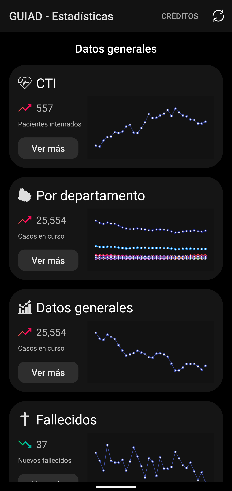
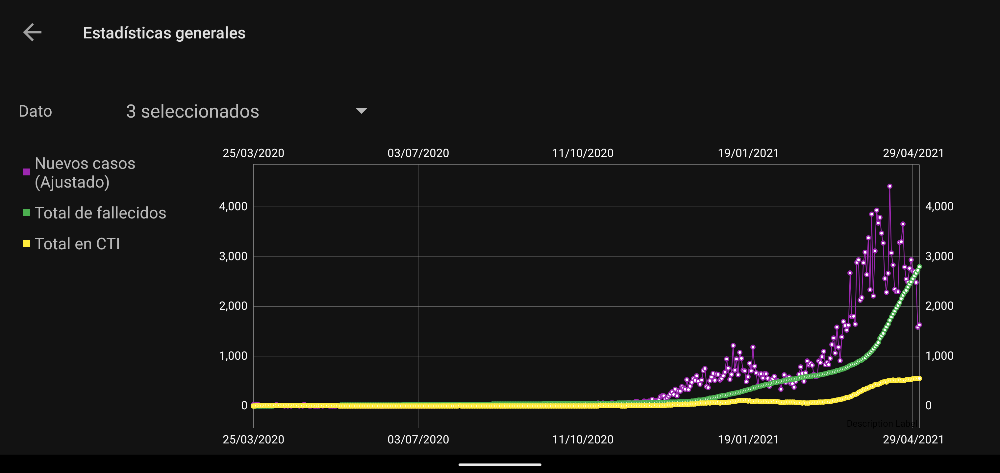
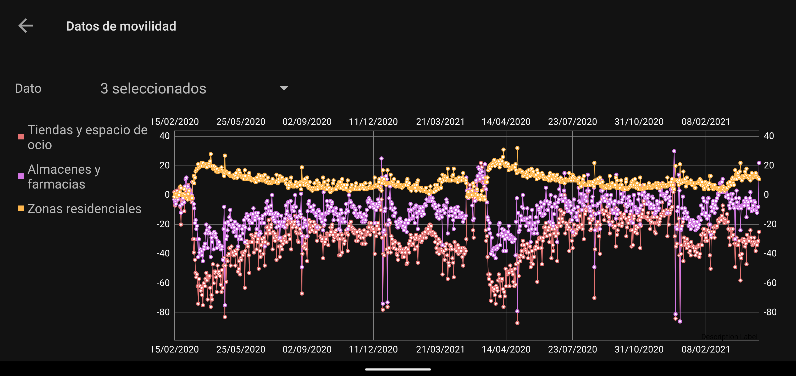
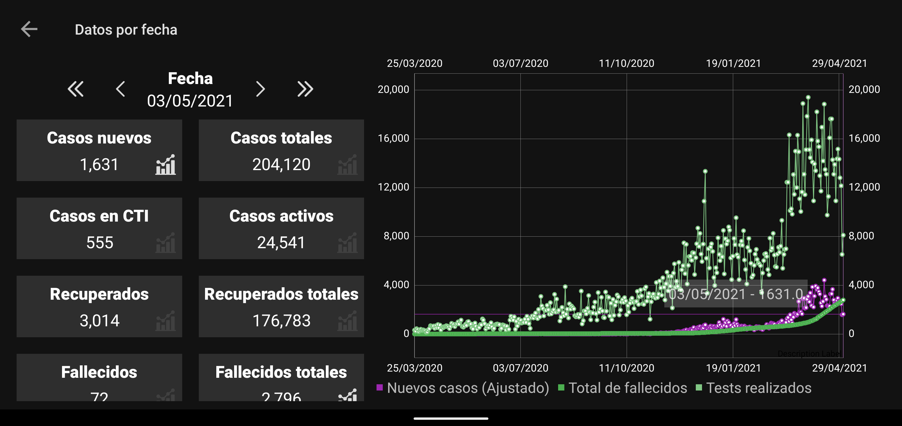
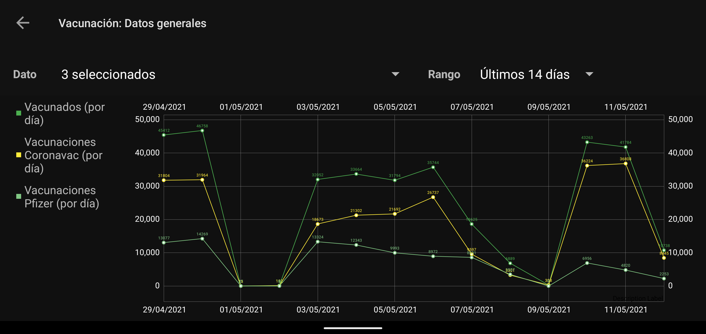

# Gráficos evolución Covid-19 en Uruguay
 
## Estadísticas COVID
GUIAD-COVID (Grupo Uruguayo Interdisciplinario de Análisis de Datos - COVID 19.)
Referencia [GUIAD-COVID](https://guiad-covid.github.io/)

Todos los datos son extraídos de la página de github del grupo ubicados en [esta carpeta](https://github.com/GUIAD-COVID/datos-y-visualizaciones-GUIAD/tree/master/datos)

## Estadísticas de vacunación
David Giordano [Github](https://github.com/3dgiordano/covid-19-uy-vacc-data)
Referencia [Vacuna.uy](https://vacuna.uy/)

Todos los datos son extraídos de la página de github del grupo ubicados en [esta carpeta](https://github.com/3dgiordano/covid-19-uy-vacc-data/tree/main/data)

Capturas de pantalla de la App
-
### Principal

### Estadísticas generales

### Datos de movilidad

### Datos por fecha

### Datos de vacunación

Librerías utilizadas
-

1. [Android MVP](https://github.com/marcherdiego/android_mvp) Para arquitectura de la App
2. [MPAndroidChart](https://github.com/PhilJay/MPAndroidChart) Para las gráficas
3. [Retrofit](http://square.github.io/retrofit/) Para la comunicación con el servidor
4. [FlowLayout](https://github.com/nex3z/FlowLayout) Para mostrar las leyendas de los gráficos de manera más legible

